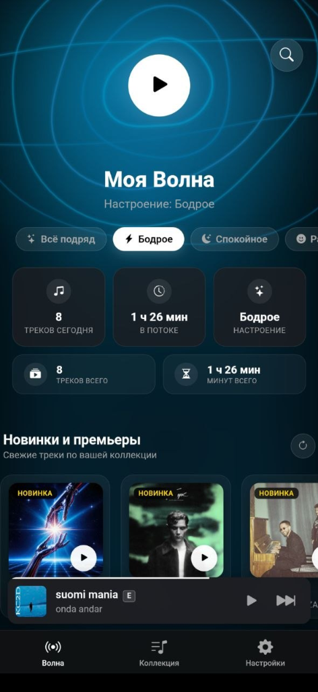

# YM Liberty (Android)

<p align="center">
  
</p>

<h3 align="center">Современный, быстрый и свободный клиент для Яндекс Музыки на Android</h3>

<p align="center">
  Бесконечная «Моя Волна», студийный звук без цензуры (FLAC / 320 kbps), динамический полноэкранный плеер в стиле Spotify и Apple Music, встроенный эквалайзер и управление через шторку Android 12+.
</p>

<p align="center">
  <a href="https://github.com/gagayhhad-tech/ym-liberty-android/releases"></a>
  <a href="LICENSE"></a>
  <a href="https://developer.android.com/"></a>
  
  
</p>

---

## 📱 Скриншот

<p align="center">
  
</p>

---

## ✨ Ключевые возможности

### 🌊 Полноценная «Моя Волна»
- **Умные рекомендации Яндекса:** прямое взаимодействие с официальным алгоритмом **Yandex Rotor API** с поддержкой всех настроений (*Всё подряд, Бодрое, Спокойное, Радостное, Открытия*).
- **Защита от зацикливания:** продвинутый механизм дедупликации — Волна больше не повторяет одни и те же треки по кругу и плавно подгружает рекомендации в фоне.
- **Статистика прослушивания:** отслеживание количества прослушанных треков и минут за день и за всё время с облачной синхронизацией.

### 💎 Обход цензуры (YM Liberty Engine)
- **Оригинальные треки:** интеграция с открытой базой [YM Liberty DB](https://github.com/gagayhhad-tech/ym-liberty-db) — автоматически заменяет запиканные и обрезанные версии песен на оригинальные студийные записи без цензуры.
- **Иконка кристалла 💎:** наглядно подсвечивает треки, в которых цензура была снята.

### 🎨 Премиальный дизайн и анимации
- **Динамический фон полноэкранного плеера:** плавное размытие обложки играющего трека с адаптивным цветовым свечением (как в Spotify и Apple Music).
- **Тактильная 3D-обложка:** мягко выдвигается вперёд при воспроизведении и отдаляется назад при паузе.
- **Интуитивные жесты:** свайп мини-плеера вверх для открытия, свайп вниз для закрытия, горизонтальные свайпы для переключения треков и навигации.

### 🎚 Студийный звук и эквалайзер
- **Максимальное качество:** поддержка HQ 320 kbps и Lossless/FLAC.
- **10-полосный эквалайзер Web Audio API:** встроенный параметрический эквалайзер с пресетами (*Bass Boost, Rock, Pop, Vocal, Acoustic, Electronic* и др.) и ручной регулировкой частот.

### 🔔 Интеграция с Android
- **Медиа-уведомление Android 12+ / 13+:** управление воспроизведением (Play/Pause, Next, Prev, прогресс-бар) прямо из системной шторки и экрана блокировки через нативный **MediaSession** и **Foreground Service**.
- **Фоновое воспроизведение:** стабильная работа в фоне без выгрузки системой.
- **Встроенный In-App автоапдейтер:** приложение само проверяет обновления через Vercel API и скачивает новые версии в один клик.

---

## 🛠 Стек технологий

- **Клиентская часть:** Современный Vanilla JS (ESNext), CSS3 Glassmorphism UI, Web Audio API, Canvas 2D Fluid Engine.
- **Платформа:** Android WebView (Cordova / Custom Smali Native Bridge, MediaSessionCompat, ForegroundService).
- **API:** Direct Client-Side Yandex Music API + Yandex Rotor Recommendation Engine.

---

## 🚀 Сборка из исходников

### Требования
- **Java JDK 17+**
- **Apktool** (2.9.3+)
- **uber-apk-signer**

### Инструкция

1. **Клонируйте репозиторий:**
   ```bash
   git clone https://github.com/gagayhhad-tech/ym-liberty-android.git
   cd ym-liberty-android
   ```

2. **Сборка APK:**
   - **На Windows:** просто запустите скрипт:
     ```cmd
     build.bat
     ```
   - **Или вручную через консоль:**
     ```bash
     # Сборка структуры проекта в APK
     java -jar apktool.jar b android_app -o YMLiberty_unsigned.apk

     # Выравнивание и подпись релизным ключом
     java -jar uber-apk-signer.jar -a YMLiberty_unsigned.apk --overwrite
     ```

Готовый APK-файл появится в корне проекта: `YMLiberty.apk`.

---

## 🌐 Экосистема YM Liberty

- [ym-liberty-android](https://github.com/gagayhhad-tech/ym-liberty-android) — Android-приложение (этот репозиторий).
- [ym-liberty-db](https://github.com/gagayhhad-tech/ym-liberty-db) — Облачная база оригинальных треков без цензуры.
- [ym-liberty-bot](https://github.com/gagayhhad-tech/ym-liberty-bot) — Telegram-бот для модерации и загрузки треков в базу.

---

## 📄 Лицензия

Проект распространяется под свободной лицензией **GNU General Public License v3.0 (GPLv3)**. Подробности см. в файле [LICENSE](LICENSE).

---

## ⚠️ Дисклеймер

Данный проект разработан исключительно в образовательных, исследовательских и ознакомительных целях. Разработчики не несут ответственности за использование приложения. Все товарные знаки, названия и права на аудиоконтент принадлежат их законным правообладателям (ООО «Яндекс» и соответствующим лейблам).
